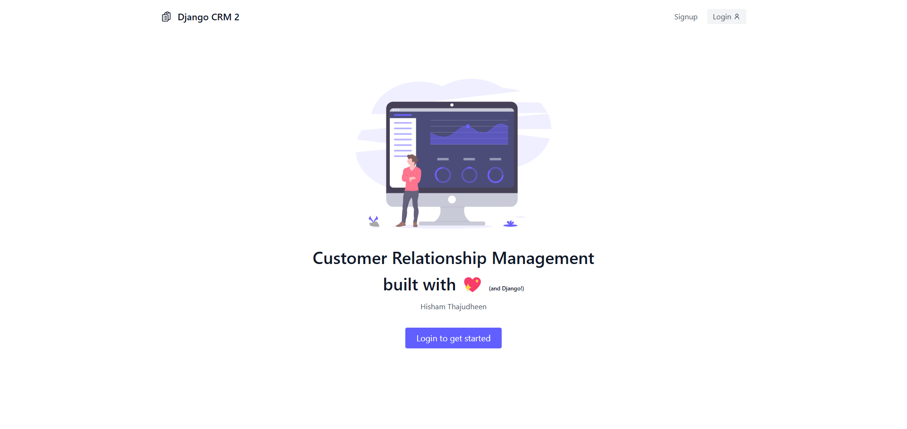
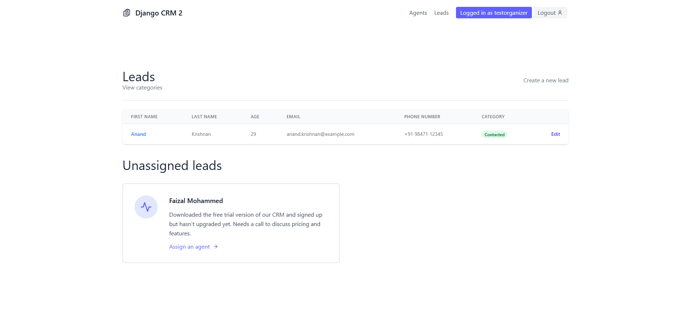
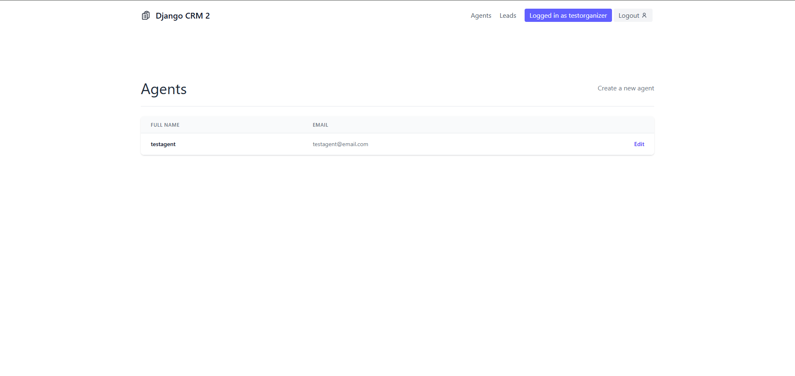

# Django CRM 2

Django CRM 2 is an advanced Customer Relationship Management (CRM) web application built with Django and PostgreSQL. It allows organizations to manage leads efficiently, assign agents, and track lead progress. The application includes role-based access, email notifications, and a clean UI styled with Tailwind CSS.

## Features

- **Role-Based Access Control**  
  - Organizers can sign up, add agents and leads, and allocate agents to leads.
  - Agents can only view and manage their assigned leads.
- **Lead Management**  
  - Create, update, and delete leads.
  - Assign leads to specific agents.
- **User Authentication & Authorization**  
  - Secure login/logout system.
  - Different permissions for organizers and agents.
- **Email Notifications**  
  - Automated email alerts for lead assignments (currently using a test mail service).
- **Modern UI**  
  - Designed with Tailwind CSS and Django Crispy forms for a clean and responsive interface.
- **Database**  
  - Uses PostgreSQL for data storage.

## Installation

### Prerequisites
Ensure you have the following installed on your system:
- Python (>= 3.x)
- pip (Python package manager)
- PostgreSQL
- virtualenv (recommended)

### Setup Instructions

1. **Clone the repository**
   ```sh
   git clone https://github.com/hishamthajudheen/django-crm2.git
   cd django-crm2
   ```

2. **Create a virtual environment**
   ```sh
   python -m venv env
   source env/bin/activate  # On Windows use: env\Scripts\activate
   ```

3. **Install dependencies**
   ```sh
   pip install -r requirements.txt
   ```

4. **Run migrations**
   ```sh
   python manage.py migrate
   ```

5. **Create a superuser (for organizer access)**
   ```sh
   python manage.py createsuperuser
   ```
   Follow the prompts to set up a username, email, and password.

6. **Start the development server**
   ```sh
   python manage.py runserver
   ```
   The application should now be accessible at `http://127.0.0.1:8000/`.

## Usage

- Sign up as an **organizer** to add agents and leads.
- Assign leads to agents and track their progress.
- Agents can log in and manage only their assigned leads.
- Email notifications will be sent when leads are assigned.

## Screenshots

Here are some screenshots of the application:




Checkout other screenshots in the screenshots folder

## Contributing

Feel free to contribute by submitting issues or pull requests. Fork the repository and make your changes in a new branch before submitting a PR.

## License

This project is licensed under the MIT License.

## Contact

For any queries or suggestions, reach out at hishamthajudheen@gmail.com
